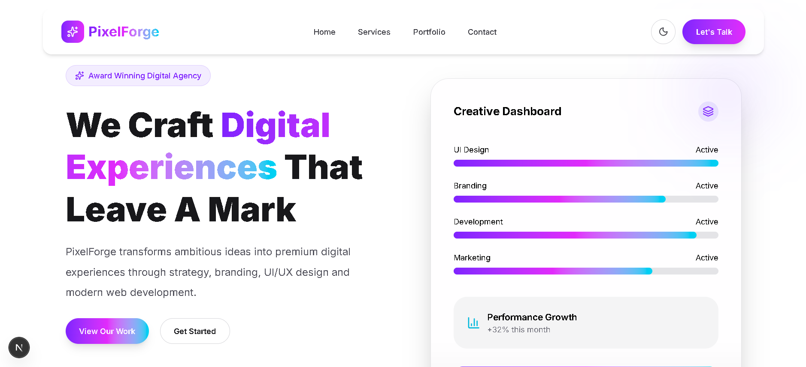
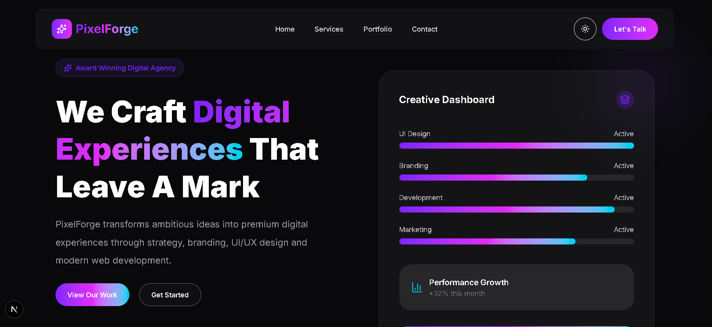

# 🎨 PixelForge – Modern Design Agency Homepage

PixelForge is a modern, responsive Design Agency landing page built using **Next.js 16**, **TypeScript**, **Tailwind CSS v4**, and **Framer Motion**.

This project was developed as part of a **Next.js Developer Internship Task** to demonstrate frontend development skills, component-based architecture, responsive design, animations, and clean UI implementation.

---

## 🚀 Live Demo

🔗 https://your-vercel-link.vercel.app

---

## 📂 GitHub Repository

🔗 https://github.com/yourusername/pixelforge

---

# ✨ Features

- Modern Hero Section
- Responsive Navigation Bar
- Light / Dark Theme Toggle
- Services Section
- Portfolio Showcase
- Contact Form UI
- Beautiful Footer
- Smooth Scroll Navigation
- Mobile Responsive Design
- Framer Motion Animations
- Glassmorphism UI
- Image Optimization using Next/Image
- SEO Ready
- Clean Folder Structure

---

# 🛠️ Tech Stack

- Next.js 16 (App Router)
- React 19
- TypeScript
- Tailwind CSS v4
- Framer Motion
- Lucide React Icons

---

# 📁 Folder Structure

```
src
│
├── app
│   ├── layout.tsx
│   ├── page.tsx
│   └── globals.css
│
├── components
│   ├── common
│   │   ├── Button.tsx
│   │   ├── Container.tsx
│   │   └── SectionBadge.tsx
│   │
│   ├── Navbar.tsx
│   ├── Hero.tsx
│   ├── Services.tsx
│   ├── Portfolio.tsx
│   ├── Contact.tsx
│   └── Footer.tsx
│
├── data
│   ├── navigation.ts
│   ├── services.ts
│   ├── portfolio.ts
│   ├── contact.ts
│   └── footer.ts
│
└── public
    └── images
```

---

# 📱 Sections

### Hero

- Agency Branding
- Call To Action
- Statistics
- Interactive Dashboard
- Animated Background

---

### Services

- UI/UX Design
- Web Development
- Branding
- Digital Marketing

---

### Portfolio

- Responsive Project Grid
- Hover Effects
- Optimized Images
- Modern Cards

---

### Contact

- Contact Information
- Contact Form
- Interactive Inputs
- Responsive Layout

---

# 🎯 Responsive Design

The website is fully responsive and optimized for:

- Mobile
- Tablet
- Laptop
- Desktop

---

# 🌙 Additional Features

- Dark Mode Toggle
- Smooth Scrolling
- Hover Animations
- Glassmorphism Navbar
- Animated Cards
- Optimized Images
- Reusable Components

---

# ⚡ Performance

- Next.js Image Optimization
- Lazy Loaded Images
- Reusable Components
- Responsive Layout
- Lightweight Animations

---

# 🧩 Installation

Clone the repository

```bash
git clone https://github.com/yourusername/pixelforge.git
```

Move into the project

```bash
cd pixelforge
```

Install dependencies

```bash
npm install
```

Run development server

```bash
npm run dev
```

Open

```
http://localhost:3000
```

---

# 🏗️ Build Project

```bash
npm run build
```

Start Production Server

```bash
npm start
```

---

# 📸 Preview

## Light Theme



## Dark Theme



---

# 📌 Assumptions

- This project focuses on frontend implementation only.
- The contact form is currently a UI component and is not connected to a backend.
- Portfolio images are used for demonstration purposes.
- All animations are intentionally lightweight to maintain performance.

---

# 📈 Future Improvements

- Backend Integration
- Form Validation
- Email Service Integration
- CMS Integration
- Blog Section
- Testimonials
- Loading Skeletons
- Multi-language Support

---

# 👨‍💻 Developed By

**Nickshan J**

Next.js Developer Internship Assignment

2026